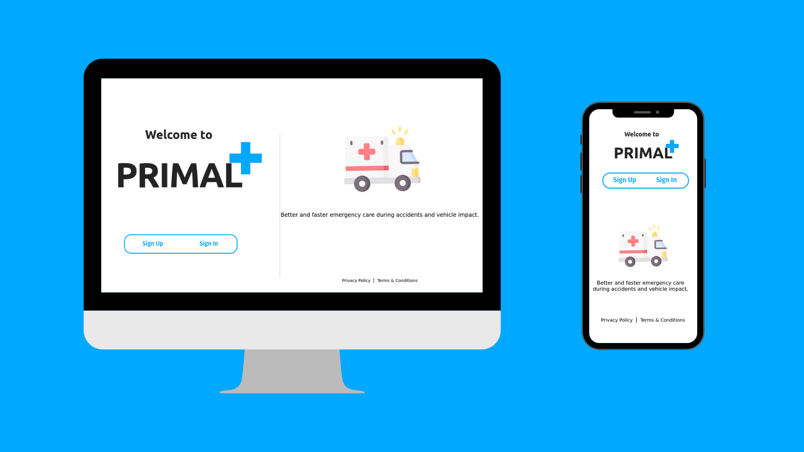
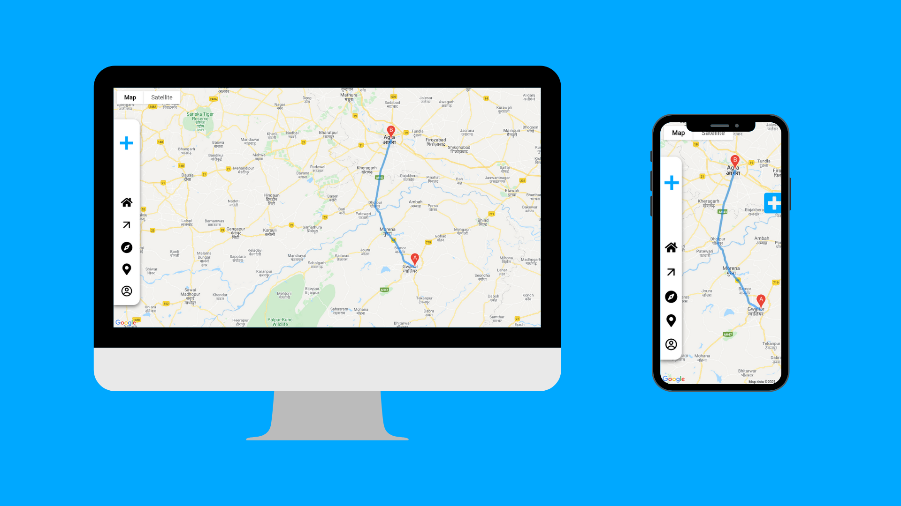
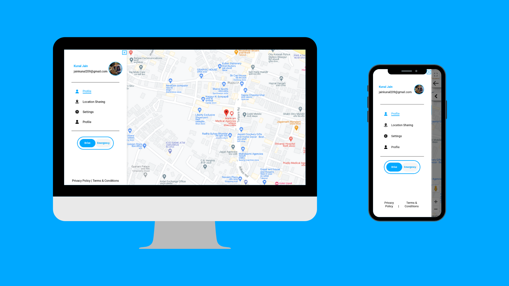
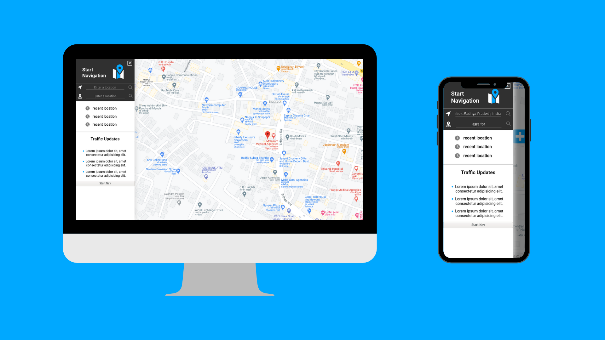

# [Incoming Emeregency Vehicle Notifier Application 🔗](https://primal6.vercel.app/)

 

# Project Description

The project aims to provide solution to the issue of traffic for emergency vehicles by providing the users on the route of the emergency vehicle, a notification when it arrives within a specific radius asking them to make way for the vehicle. It also provides the emergency vehicle the best possible route for reaching its destination. The project also aims to provide feature for reporting an emergency situation in very few steps which is then notified to all emergency vehicle drivers to act upon it instantly.

 

# Thought behind the Project

We've all came across situations where we see emergency vehicles with patients struggling their way through traffic, or situations where a accident happens and emergency vehicle drivers get notified too late to take an action. Our thought behind this project is to find solution to these issues by notifing the users of our app about an incoming emergency vehicle on their route and asking them to make way for it. Our app also gives its users an option to trigger an emergency and notify emergency vehicle drivers about the emergency situation so that necessary actions can be taken immediately.

 

# Features Implemented

## 1. Frontend

1. All **required** frontend designs are built and are available on different routes (Some of them are still to be integrated with the backend for funcionality). All designs are available here on this [link](https://xd.adobe.com/view/569ca051-2561-4693-b97b-35a37b8b8b4c-03cf/). These designs include the following:

   - Landing Page
   - Login/Signup Page
   - Profile Page
   - Navigation Menu
   - Direction Notifiers
   - Create Emeregency

2. User Authentication has been integrated into the frontend.
3. Maps API has been integrated into the frontend.
4. Google places autocomplete has been integrated into the frontend for location suggestions.
5. Navgation has been setup and is in working state.

## 1. Backend

1. GraphQl and Apollo Server have been setup.
2. User schemas, types & queries have been setup.
3. Login & SignUp mutations have been setup.
4. User authentication mutation using JWT has been setup.

 

# Features to Implement

## 1. Frontend

1. Integration of remaining backend APIs when they are completed.

## 1. Backend

1. Create Emeregency schema, queries and mutations.
2. Setting up GraphQl Subscription for building continious integration between emergency vehicle driver notfication and emergency creation.
3. Handling emergencies once triggered in frontend by giving navigation routes.
4. Updating users once an emergency vehicle is within a specified radius.
5. Some optimizations.

 

# Technologies and Packages Used

## 1. Frontend

1. React
2. Apollo Client
3. Google Maps API
4. Google Maps Navigation API
5. React Google Autocomplete for places suggestions.

## 2. Backend

1. Node
2. Express
3. GraphQl
4. Apollo Client
5. MongoDB
6. Mongoose
7. JWT
8. Bcryptjs

 

# Local Setup

Clone the frontend and backend repositories, cd into them individually, and then follow the below mentioned steps for setting up backend and frontend seprately.

## 1. Frontend

1. Run `npm install`.
2. Generate your Map API key using this [link](https://console.cloud.google.com/google/maps-apis/overview?pli=1) and replace it with the keys in index.html & Map.js files of frontend.
3. Change backend port in App.js file if you change it in backend, by default the backend is setup to run on port 8000.

## 2. Backend

1. Run `npm install`.
2. We used MongoDB Atlas for hosted database, you can have a local database if you want but we recommend using Atlas. If you are using Atlas replace your database link in keys.js file of backend.
3. Set your JWT secret in keys.js file of backend.

Run `npm start` in the Backend repo first and then in Frontend .

### Connect with me:

